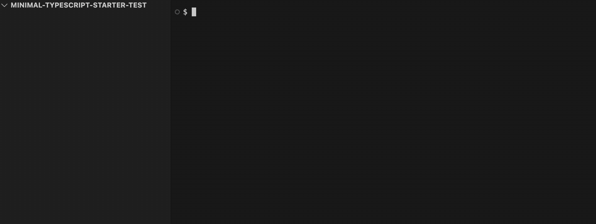

# minimal-typescript-starter



This package helps you quickly set up a TypeScript project with minimal configuration.

## Usage

To use this starter kit, simply run the following command:

```bash
npx minimal-typescript-starter [path]
```

By default, the following files will be generated:

- tsconfig.json
- package.json
- package-lock.json
- src/index.ts
- .gitignore
- README.md

You can also set up the following additional packages in the prompt:

- .eslintrc
- .prettierrc
